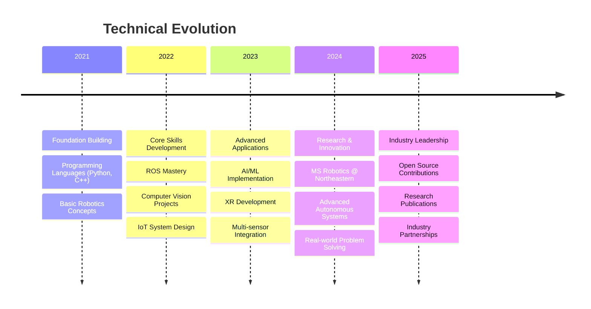
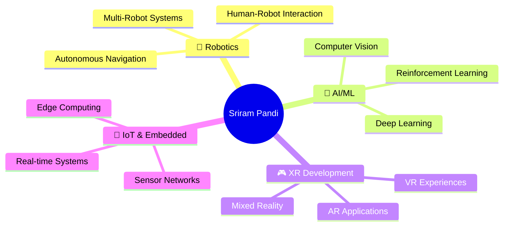

<div align="center">

<!-- Dynamic Typing Header -->
[](https://git.io/typing-svg)

<!-- Professional Banner -->


<!-- Badges Row -->
[](https://www.linkedin.com/in/sriram-pandi)
[](https://www.instagram.com/sriram_kanna_)
[](https://wa.me/+18573130177)
<!-- [](#) -->

<!-- Profile Views Counter -->
<!--  -->

</div>

---

## 🎯 **About Me**


```python
class SriramPandi:
    def __init__(self):
        self.name = "Sriram Pandi"
        self.role = "Robotics Engineer & AI Researcher"
        self.location = "Boston, MA"
        self.education = "Northeastern University"
        
    def current_focus(self):
        return [
            "🤖 Autonomous Systems & Navigation",
            "🧠 Computer Vision & Deep Learning", 
            "🎮 XR/VR Development",
            "🔧 Sensor Fusion & IoT Systems"
        ]
    
    def future_goals(self):
        return "Building intelligent systems that bridge the gap between digital and physical worlds"
```

🎓 **MS in Robotics** @ Northeastern University  
🏢 **Specializing in** Real-world AI Applications  
🌟 **Passionate about** Creating technology that matters  

---

## 🚀 **Featured Projects**

<div align="center">

### 🤖 **ROBOTICS & ROS**
*Building intelligent systems that interact with the physical world*

</div>

<details>
<summary><b>🦾 Assistive Feeding Robot</b> - <i>ROS-based autonomous feeding system</i></summary>

<br>

**🎯 Project Overview:**  
Advanced ROS-based assistive robotic system providing automated feeding assistance for individuals with mobility challenges.

**⚡ Key Features:**
- 🔍 Autonomous food detection and classification
- 🎯 Precise robotic arm trajectory planning  
- 🛡️ Safety-first human-robot interaction protocols
- 🔧 Modular ROS architecture for scalability

**🛠️ Tech Stack:** `Python` `ROS` `Computer Vision` `OpenCV` `Robotics`

[](https://github.com/Sriram-Pandi/Assistive-Feeding-Robot)

</details>

<details>
<summary><b>🚁 Autonomous Rescue Robot</b> - <i>TurtleBot-based search & rescue system</i></summary>

<br>

**🎯 Project Overview:**  
Intelligent autonomous rescue robot built on TurtleBot platform for search and rescue missions in hazardous environments.

**⚡ Key Features:**
- 🗺️ Autonomous navigation in unknown environments
- 🚧 Real-time obstacle detection and avoidance
- 🎯 Optimized search patterns for rescue missions
- 📡 Emergency response protocol integration

**🛠️ Tech Stack:** `ROS` `C++` `TurtleBot` `SLAM` `Navigation Stack`

[](https://github.com/Sriram-Pandi/Autonomous-Rescue-Robot-using-turtle-bot)

</details>

<details>
<summary><b>🧭 Advanced Sensor Fusion</b> - <i>Multi-sensor navigation system</i></summary>

<br>

**🎯 Project Overview:**  
Advanced sensor fusion implementation combining IMU, odometry, and GPS for robust dead reckoning and autonomous navigation.

**⚡ Key Features:**
- 🔀 Multi-sensor data fusion algorithms
- 📊 Kalman filter implementation for state estimation
- 🎯 Dead reckoning with drift correction
- ⚡ Real-time navigation performance optimization

**🛠️ Tech Stack:** `Python` `Sensor Fusion` `Kalman Filters` `IMU` `GPS`

[](https://github.com/Sriram-Pandi/SensorFusion-DeadReckoning-Sensing-and-Navigation)

</details>

---

<div align="center">

### 🧠 **MACHINE LEARNING & COMPUTER VISION**
*Developing intelligent systems that see, understand, and learn*

</div>

<details>
<summary><b>👁️ Real-time Sign Language Detection</b> - <i>YOLOv8-powered accessibility solution</i></summary>

<br>

**🎯 Project Overview:**  
Cutting-edge real-time sign language detection system powered by YOLOv8 architecture, enabling accessibility through automated recognition.

**⚡ Key Features:**
- 🤖 YOLOv8-based sign language detection
- ⚡ Real-time gesture recognition
- 📚 Multi-sign vocabulary support
- ♿ Accessibility-focused design

**🛠️ Tech Stack:** `Python` `YOLOv8` `Computer Vision` `Jupyter Notebook`

[](https://github.com/Sriram-Pandi/Realtime-Sign-Languuage-Detector_using-YOLOv8)

</details>

<details>
<summary><b>🎯 Multi-class Image Segmentation</b> - <i>Deep learning-powered pixel classification</i></summary>

<br>

**🎯 Project Overview:**  
Advanced multi-class image segmentation system using deep learning for pixel-level classification in autonomous navigation applications.

**⚡ Key Features:**
- 🎨 Pixel-level semantic segmentation
- 🏷️ Multi-class object classification
- 🧠 Deep learning model training
- 📊 Comprehensive visualization tools

**🛠️ Tech Stack:** `Python` `Deep Learning` `Image Segmentation` `Jupyter Notebook`

[](https://github.com/Sriram-Pandi/Multiclass_Segmentation)

</details>

<details>
<summary><b>⚡ Real-time Object Detection</b> - <i>High-performance computer vision system</i></summary>

<br>

**🎯 Project Overview:**  
High-performance real-time 2D object detection system optimized for live video streams with efficient algorithms.

**⚡ Key Features:**
- ⚡ Real-time object detection and tracking
- 🎥 Optimized for live video processing
- 🏷️ Multiple object class support
- 📊 Advanced bounding box visualization

**🛠️ Tech Stack:** `C++` `OpenCV` `Computer Vision` `Real-time Processing`

[](https://github.com/Sriram-Pandi/Realtime-2D-Object-detection)

</details>

---

<div align="center">

### 🎮 **XR & UNITY DEVELOPMENT**
*Creating immersive experiences that bridge reality and imagination*

</div>

<details>
<summary><b>🎯 AR Darts Game</b> - <i>Immersive augmented reality experience</i></summary>

<br>

**🎯 Project Overview:**  
Immersive augmented reality darts game featuring advanced plane detection and interactive gameplay mechanics for engaging AR experiences.

**⚡ Key Features:**
- 🎯 AR plane detection and tracking
- ⚖️ Physics-based dart throwing mechanics
- 📊 Real-time score calculation
- 🎮 Interactive 3D game environment

**🛠️ Tech Stack:** `Unity` `C#` `AR Foundation` `XR Toolkit` `Physics Simulation`

[](https://github.com/Sriram-Pandi/XR-App-4-AR-Darts-Game)

</details>

<details>
<summary><b>🥊 VR Rhythm Punching Game</b> - <i>Beat Saber-inspired fitness experience</i></summary>

<br>

**🎯 Project Overview:**  
High-energy VR rhythm game inspired by Beat Saber, featuring synchronized punching mechanics with music beats for immersive fitness gaming.

**⚡ Key Features:**
- 🎵 Music-synchronized gameplay mechanics
- ✋ VR hand tracking and gesture recognition
- 🎮 Dynamic obstacle generation
- 💪 Fitness tracking integration

**🛠️ Tech Stack:** `Unity` `VR SDK` `C#` `Audio Processing` `Hand Tracking`

[](https://github.com/Sriram-Pandi/XRA3-VR-Rhythm-Based-Punching-Game)

</details>

<details>
<summary><b>🏠 Immersive Home Construction XR</b> - <i>Revolutionary architectural visualization</i></summary>

<br>

**🎯 Project Overview:**  
Revolutionary XR application for immersive home design and construction visualization in both AR and VR environments.

**⚡ Key Features:**
- 🏗️ AR/VR home design visualization
- ⚡ Real-time architectural modifications
- 📐 Immersive construction planning
- 🔄 Multi-platform XR support

**🛠️ Tech Stack:** `Unity` `AR/VR` `C#` `3D Modeling` `Architecture Visualization`

[](https://github.com/Sriram-Pandi/Immersive-Home-Construction-XR-Application)

</details>

---

## 🛠️ **Technology Arsenal**

<div align="center">

### **Programming Languages**


### **Frameworks & Libraries**


### **Tools & Platforms**


</div>

---

## 🌟 **Portfolio Highlights**

<div align="center">

### **📊 Technical Achievements**
**23 Public Repositories** • **Cross-Disciplinary Expertise** • **Real-World Applications**

</div>

<table>
<tr>
<td align="center">

<br><b>Active Projects</b>
<br>Diverse portfolio spanning multiple domains
</td>
<td align="center">

<br><b>Core Expertise</b>
<br>Robotics • AI/ML • XR • IoT
</td>
<td align="center">

<br><b>Real-World Impact</b>
<br>Solutions addressing practical challenges
</td>
</tr>
</table>

---

## 💪 **Technical Expertise Levels**

<div align="center">

| Domain | Proficiency | Technologies |
|--------|-------------|--------------|
| 🤖 **Robotics & ROS** | ████████████████████ **95%** | ROS, Navigation, SLAM, Control Systems |
| 🧠 **Computer Vision** | ██████████████████░░ **90%** | OpenCV, Deep Learning, Image Processing |
| 🎮 **XR Development** | ████████████████░░░░ **85%** | Unity, AR Foundation, VR SDKs |
| 🔧 **Embedded Systems** | ██████████████░░░░░░ **80%** | Arduino, Raspberry Pi, IoT Sensors |
| 📊 **Data Science** | ██████████████░░░░░░ **80%** | Python, TensorFlow, PyTorch, Analytics |

</div>

---

## 📈 **Professional Journey**

<div align="center">



</div>

### **🎯 Current Status:**
- **🎓 Education:** MS in Robotics @ Northeastern University
- **🔬 Research Focus:** Multi-modal sensor fusion for autonomous systems  
- **💼 Industry Engagement:** Collaborative projects with robotics companies
- **📚 Knowledge Sharing:** Contributing to open-source robotics frameworks

---

## 🎯 **Current Focus & Goals**

<div align="center">



</div>

### **2025 Goals:**
- 🎯 **Research Focus:** Advanced multi-modal sensor fusion for autonomous systems
- 🚀 **Open Source:** Contributing to major robotics frameworks and libraries  
- 🎓 **Knowledge Sharing:** Publishing research papers and technical blog posts
- 🤝 **Collaboration:** Building partnerships with industry leaders in robotics and AI

---

## 📞 **Let's Connect & Collaborate**

<div align="center">

### **Ready to build the future together?**

I'm always excited to discuss innovative projects, research opportunities, and potential collaborations in robotics, AI, and XR development.

[](mailto:pandi.s@northeastern.edu)
[](https://www.linkedin.com/in/sriram-pandi)
[](https://wa.me/+18573130177)

**⚡ "Let's build things that matter - where technology meets human needs."**

</div>

---

<div align="center">

<!-- Footer Wave -->


<!-- Snake Animation -->


**⭐ Star my repositories if you find them interesting!**

</div>
